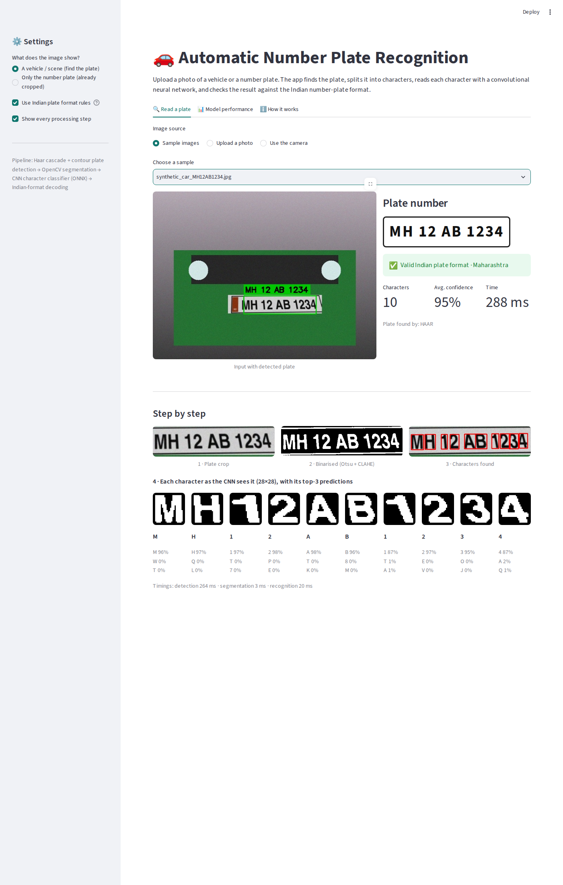
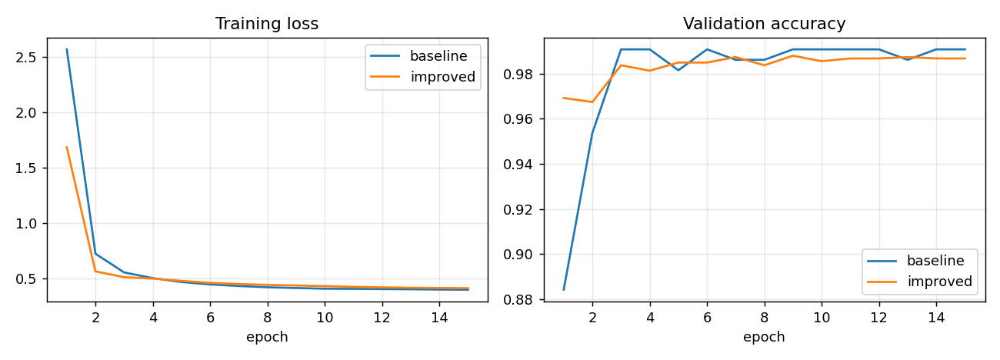

# Automatic Number Plate Recognition (ANPR) for Indian Plates

A computer-vision capstone project. The app takes a photo of a vehicle (or a cropped number plate),
finds the plate, splits it into characters, reads each character with a **Convolutional Neural Network**,
and checks the result against the Indian number-plate format.

Based on the approach in the Kaggle notebook
[License plate recognition using CNN](https://www.kaggle.com/code/sarthakvajpayee/license-plate-recognition-using-cnn/notebook)
(Haar cascade, then contour segmentation, then CNN), reimplemented and extended.



## Pipeline

| Step | Method | File |
|---|---|---|
| 1. Plate detection | Haar cascade trained on Indian plates, plus a contour-based fallback; every candidate is validated by segmentation | `anpr/detect.py` |
| 2. Character segmentation | Resize, CLAHE, Otsu threshold, connected components, size/shape filters, outlier removal (drops the IND emblem and screws) | `anpr/segment.py` |
| 3. Character recognition | CNN (2 conv blocks + batch-norm, 0.88 M params, 36 classes 0-9 A-Z), trained in PyTorch, exported to ONNX, run with OpenCV DNN | `anpr/recognize.py` |
| 4. Format decoding | Picks the most likely reading that fits `SS NN XXX NNNN` (or Bharat series `YY BH NNNN XX`) with a real state code, using the CNN's probabilities | `anpr/postprocess.py` |

## Results

Evaluated on 300 synthetic plates rendered in **fonts never used in training**, plus the real sample plate.

| Metric | Baseline (reference Kaggle CNN) | Improved model |
|---|---|---|
| Character accuracy, original validation set | 99.1% | **100.0%** |
| Character accuracy, unseen plate-style fonts | 94.5% | **99.6%** |
| Plates segmented correctly | 98.0% | 98.0% |
| Whole plate read exactly (no format rules) | 83.7% | **96.7%** |
| Whole plate read exactly (with format rules) | 88.7% | **96.7%** |
| Real plate `DL8CAF5030` | correct | correct |

**What made the difference:** the original character dataset (864 training images) uses one serif font,
while real Indian plates use plain block letters. The improved model adds synthetic characters rendered in
11 sans-serif fonts with realistic distortions (tilt, blur, noise, thickness), and uses a deeper CNN with
batch normalisation. Indian-format decoding gives the weaker baseline +5 points. With the improved model,
the remaining errors are mostly segmentation failures, not recognition errors.



## Run the app online
Deploy on [Streamlit Community Cloud](https://share.streamlit.io) with `app.py` as the main file.
The app needs only `streamlit`, `opencv-python-headless`, `numpy`, `pandas` and `pillow`; no GPU and no API key.

## Run locally
```bash
pip install -r requirements.txt
streamlit run app.py
pytest -q                                   # 11 tests
```

## Re-train the model
```bash
pip install -r training/requirements-train.txt
python training/train_cnn.py                # about 13 min on CPU, 1-2 min on a GPU
```
This trains both models, evaluates them, exports `models/char_cnn.onnx` and writes `models/metrics.json`,
`docs/training_curves.png` and `docs/confusion_matrix.png`. A Colab version is in
`training/ANPR_Training_Colab.ipynb`.

## Project structure
```
app.py                     Streamlit app
anpr/                      detection, segmentation, recognition, decoding, synthetic data
models/                    char_cnn.onnx (deployed model), char_cnn.pt, Haar cascade, metrics.json
samples/                   1 real plate + 5 synthetic test images
training/                  train_cnn.py, Colab notebook, character dataset (data.zip)
tests/                     pytest tests
docs/                      screenshots, training curves, confusion matrix
```

## Limitations
- The character dataset is small, and the end-to-end evaluation uses synthetic plates (one real plate). Results on
  real street photos will be lower, especially at night, at steep angles, or with dirty or non-standard plates.
- Two-line plates (common on two-wheelers) are not supported; segmentation assumes one line of characters.
- The Haar cascade is fast but dated. A YOLO plate detector would be more robust; this is the natural next step.

## Credits and licence
Character dataset, sample plate and Haar cascade (`models/indian_license_plate.xml`) come from
[SarthakV7/AI-based-indian-license-plate-detection](https://github.com/SarthakV7/AI-based-indian-license-plate-detection)
by Sarthak Vajpayee, licensed under GPL-3.0. This project is therefore also released under the
**GNU GPL-3.0** (see `LICENSE`). Synthetic samples (`samples/synthetic_*`) were generated by `anpr/synth.py`
and contain fictional plate numbers.
